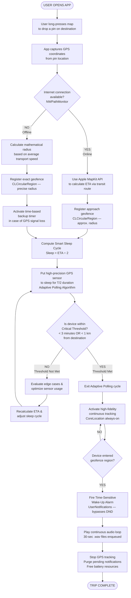

# BusNap — Trip Initialization & Adaptive Polling Flowchart



---

## Flow Summary

### Phase 1 — Trip Initialization & Configuration
| Step | Action | Framework |
|------|--------|-----------|
| 1 | User drops a pin on the map | `MKMapView` |
| 2 | App captures GPS coordinates | `CoreLocation` |
| 3 | System checks internet connectivity | `NWPathMonitor` |
| 3a (Online) | Apple API calculates ETA → approach geofence registered | `MKDirections` / `CLCircularRegion` |
| 3b (Offline) | Math radius from avg. speed → exact geofence + backup timer | `CLCircularRegion` / Timer |

### Phase 2 — Adaptive Polling (Smart Sleep Cycle)
| Step | Action |
|------|--------|
| 4 | Compute sleep duration = ETA ÷ 2 |
| 5 | GPS sensor sleeps for T/2 (drastically reduces battery drain) |
| 6 | Wake up and re-evaluate position |

### Phase 3 — Evaluation Loop (Critical Threshold)
| Step | Action |
|------|--------|
| 7 | Check if device is within < 3 min or < 1 km from destination |
| 7a (Not met) | Evaluate edge cases → recalculate ETA → loop back to sleep |
| 7b (Met) | Exit optimization → activate high-fidelity continuous tracking |

### Phase 4 — Trigger & Cleanup
| Step | Action | Framework |
|------|--------|-----------|
| 8 | Geofence entry detected | `CLCircularRegion` |
| 9 | Fire Time-Sensitive alarm (bypasses DND / Focus modes) | `UserNotifications` |
| 10 | Play continuous `.wav` audio loop | AVFoundation |
| 11 | Stop GPS, purge notifications, free battery | `CoreLocation` / `UserNotifications` |
```
